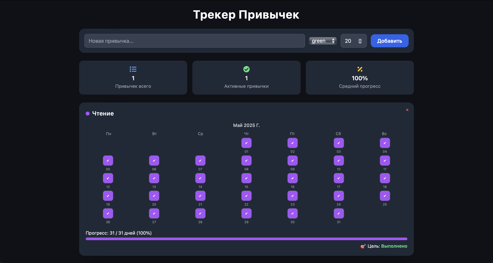

# 🧩 Habit Tracker — Трекер Привычек

Современное адаптивное веб-приложение для отслеживания ежедневных привычек. Минимализм, тёмный интерфейс, кастомные цели и красивый календарь.



---

## 🚀 Функции

- 📆 Реальная календарная сетка месяца
- 🎯 Настраиваемая цель выполнения (например, 20 из 31)
- 🖍 Цветовая метка привычки
- 📊 Прогресс-бар и статус достижения цели
- ❌ Удаление привычки
- 🌗 Поддержка тёмной темы
- 📱 Адаптивный дизайн на весь экран
- 💾 Сохранение данных в `localStorage`

---

## 🛠️ Технологии

- React
- Tailwind CSS
- React Icons
- Google Fonts (`Inter`)
- Полная адаптивность с мобильной поддержкой

---

## 📦 Установка и запуск

```bash
git clone https://github.com/hlibyelkhov/habit-tracker.git
cd habit-tracker
npm install
npm run dev
